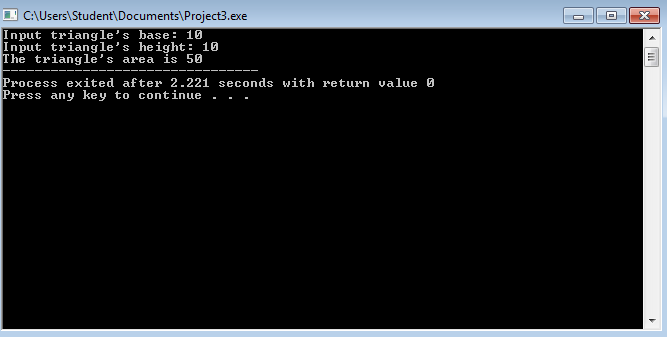

# Activity1-Giron
	##Area of the Triangle
```
#include <stdio.h>
#include <stdlib.h>


int main(int argc, char *argv[]) {
	
	int area, base, height;
	
	
	printf("Input triangle's base: ");
	scanf("%d", &base);
	
	printf("Input triangle's height: ");
	scanf("%d", &height);
	
	area=(base*height)/2;
	
	printf("The triangle's area is %d", area);
	return 0;
}
```



```
#include <stdio.h>
#include <stdlib.h>


int main(int argc, char *argv[]) {
	int year, age;
	
	printf("Input your birth year: ");
	scanf("%d",&year);
	
	age=2016-year;
	
	printf("Your age is %d", age);
	return 0;
}
```


```
#include <stdio.h>
#include <stdlib.h>


int main(int argc, char *argv[]) {
	float num;
	float fofx;
	printf("Input a value for x: ");
	scanf("%f", &num);
	
	fofx=(num/70);
	
	printf("f(x) is equal to %.2f", fofx);
	return 0;
}
```


